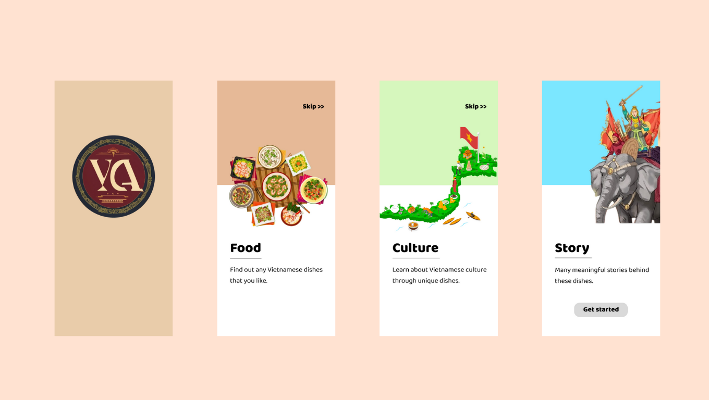
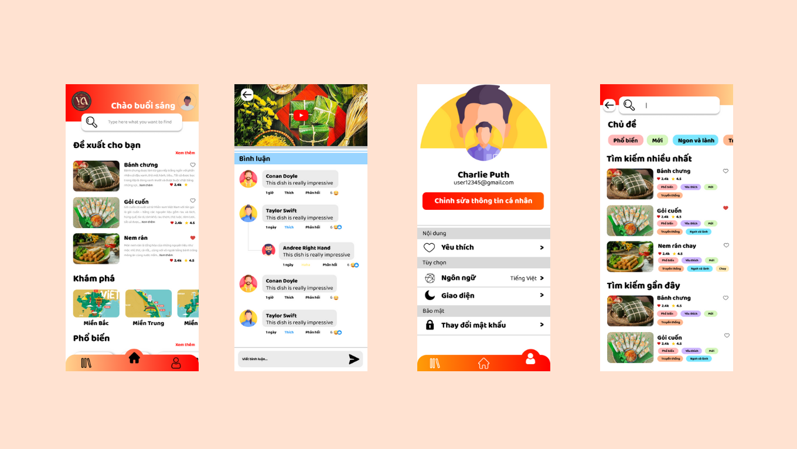

# VietNamese Cuisine Adventure

# Hình ảnh minh họa

- Màn hình khởi động

- Màn hình chính

# Môn học

- Đây là dự án bài tập lớn môn Thiết kế giao diện người dùng

- Giảng viên: Ngô Thị Duyên

# Nhóm 14

Nhóm học sinh bao gồm:

- Trần Quý Mạnh - 21020352
- Nguyễn Hải Long - 21020349
- Nguyễn Hoài Nam - 21020779
- Bùi Đặng Đức Phong - 21020781

# Mô tả ứng dụng

- VietNamese Cuisine Adventure là ứng dụng với mục đích quảng bá văn hóa ẩm thực của Việt Nam trên mọi vùng miền của Tổ quốc
- Thông qua các bài viết thú vị bao gồm hình ảnh, video, ý nghĩa cũng như công thức đằng sau mỗi món ăn

# Tài liệu thiết kế dự án

- Tài liệu thiết kế giao diện: [Figma](https://www.figma.com/file/B3vUJhLtZ36TaMB4zG8f3L/Demo-2?type=design&node-id=44-1245&mode=design&t=aIlryjMkJYBzWfio-0)
